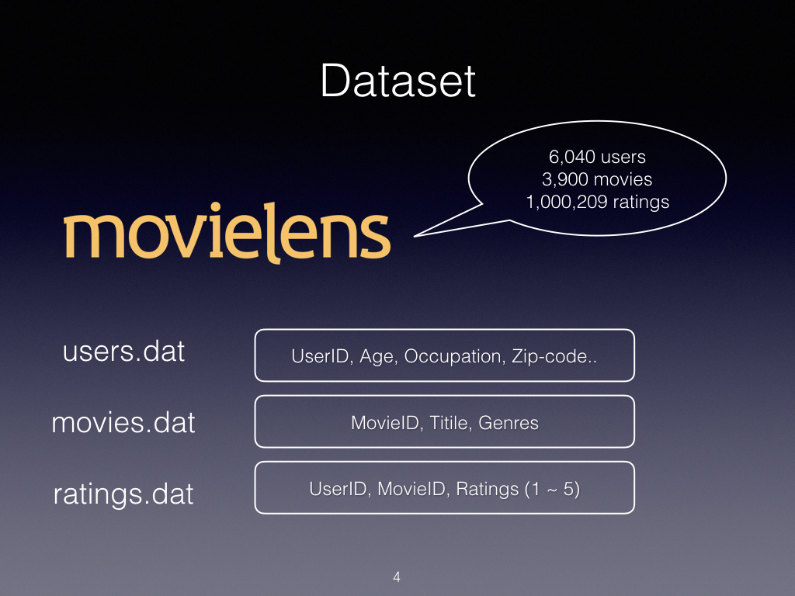
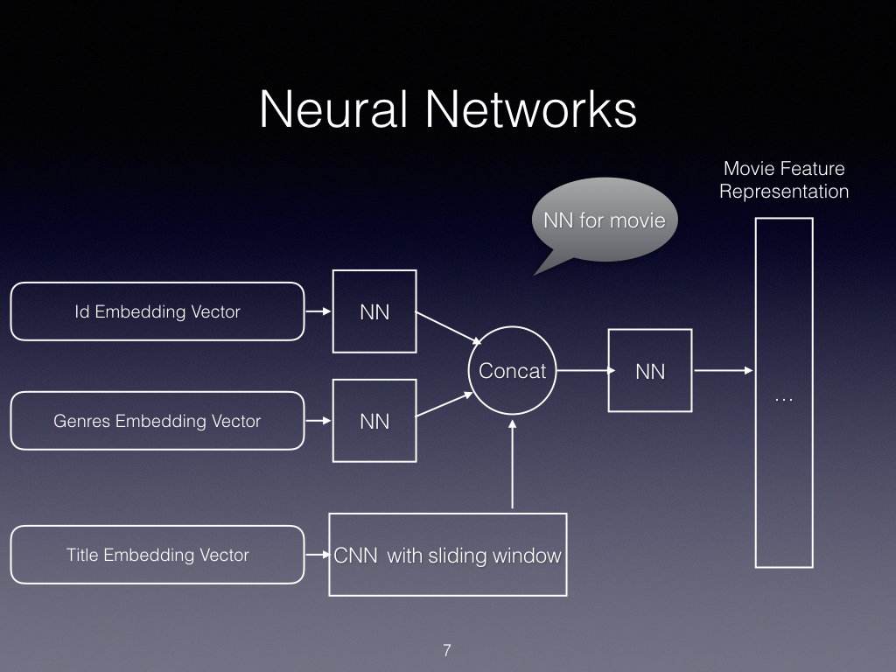
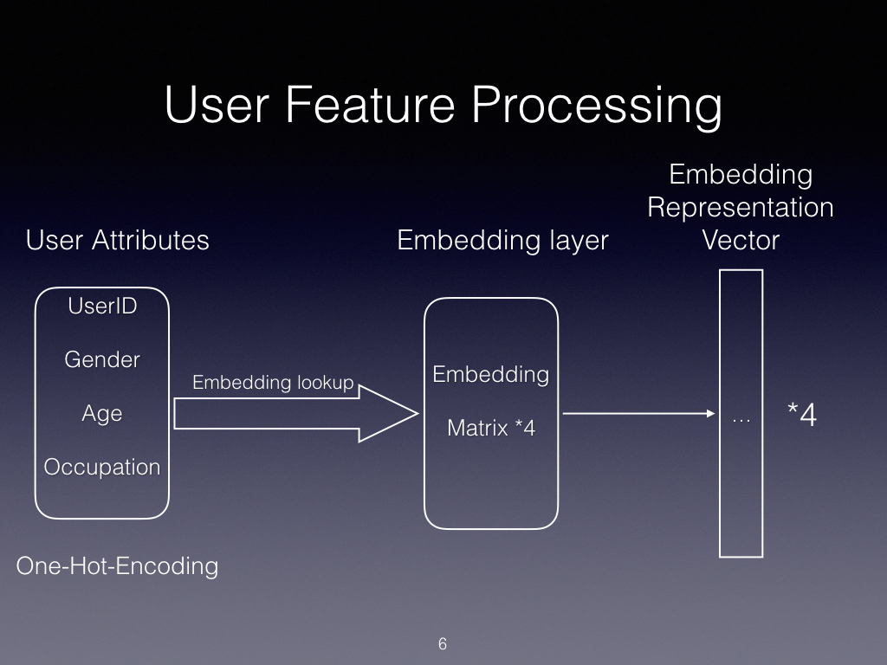
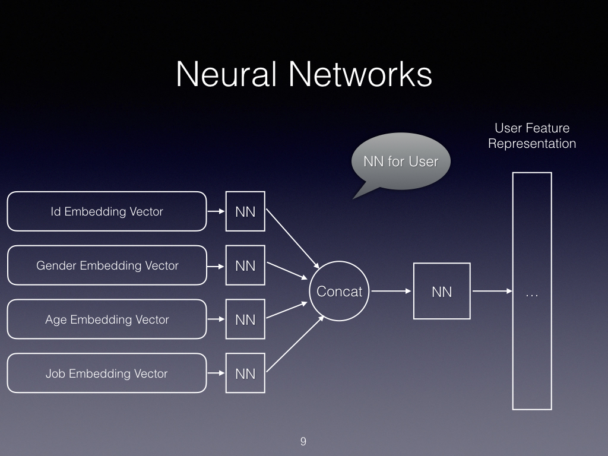
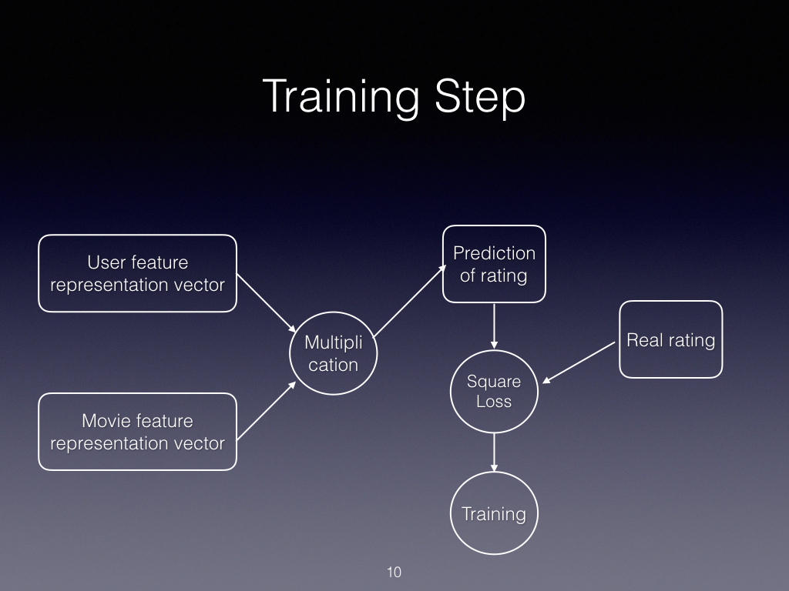
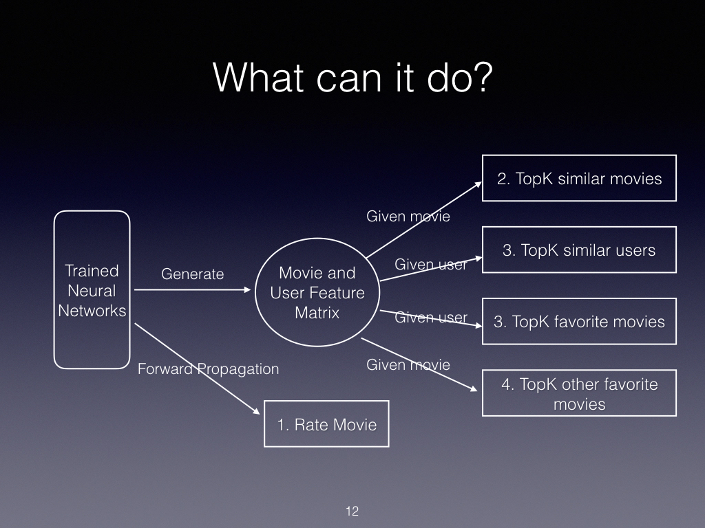

# 关于本项目
本项目是使用python3 + tensorflow，搭建一个基于卷积神经网络模型的离线电影推荐系统，电影数据集使用的是MovieLens中的ml-1m.zip数据集。核心思想对于电影和用户的不同属性，构建多个神经网络进而获得每个属性的特征表示。使用这些特征表示构建用户特征矩阵和电影特征矩阵，进而完成推荐任务。

## 技术说明
- python：3.5.2
- tensorflow: 1.8.0
- numpy: 1.14.0

## 如何运行
该项目目前还没有对整个流程进行集成，所以需要按照步骤顺序运行对应文件
1. 运行data_download.py 文件，下载对应的数据集并进行校验
2. 运行data_processing.py 文件，对下载的数据集进行处理，并将处理产生的特征存储在model文件夹中生成features.p 和 params.p 文件
3. 运行model文件夹中的training.py文件，对神经网络进行训练
4. 运行model文件夹中的recommendation文件，测试各种推荐方法

# 关于数据集
本项目使用的是MovieLens的ml-1m数据集，该数据集合包含6,040名用户对3,900个电影的1,000,209个匿名评论。

数据集包括movies.dat, ratings.dat, users.dat三个文件

#### movies.dat
该数据集存储了电影信息，包含字段：MovieID，Title，Genres
- MovieID: 电影ID(1-3952)
- Title：电影标题，包括出版年份
- Genres：电影类别（包括喜剧，动作剧，纪录片等..)

详细内容可以参照ml-1m/README

#### users.dat
该数据集包含了对电影进行评分的用户信息，包括字段：UserID，Gender，Age，Occupation，Zip-code
- UserID：用户ID(1-6040)
- Gender：性别（“M” or “F”）
- Age：年龄，该年龄不是连续变量，而是被分为7个年龄集合（under 18；18-24；25-34；35-44...）
- Occupation：职业，这里用数字0-20表示各个职业

详细内容可以参照ml-1m/README

#### ratings.dat
该数据集是用户对电影的评分，包括字段：UserID::MovieID::Rating::Timestamp。  
其中rating取值为：0，1，2，3，4，5  
Timestamp表示时间戳  
每个用户有最少20个评分

详细内容可以参照ml-1m/README

# 文件组成
项目共有三部分组成：1：数据下载和处理，2：模型构建和训练，3：推荐测试

## 数据下载和处理
分别为`data_download.py`和`data_processing.py`文件。

### data_download  
运行`data_download.py`会自动下载ml-1m数据集并解压到当前目录。  
该文件包含`downl_data` `extract_data`两个函数和用来显示下载进度的类DLProgress

### data_processing
该文件主要包含多个对原始数据进行处理的函数，将原始数据载入并进行处理，然后将处理后的数据和对应的映射和参数保存到本地。使用pickle保存为`.p`文件
1. `user_data_processing`函数对user数据进行处理，其中：
    - UserID 不做处理
    - JobID 不做处理
    - Gender 将‘F’和‘M’转换0和1
    - Age 转换为0~6七个离散数字分别代表不同年龄段
    - zip-code 舍弃
2. `movie_data_processing`函数对movie数据进行处理，其中：
    - movie_ID 不做处理
    - Genres 表示电影的类别，每个电影可能有多个genres标签，需要构建genre_to_index映射将每个电影的genres映射成一个定长的integer list表示
    - Title 首先去除掉title中的year，然后以word为粒度构建word_to_index映射将每个电影的title映射成一个定长的integer list表示
3. `rating_data_processing`函数对rating数据进行处理，其中：
    - 保留MovieID， UserID，ratings。将timestamps删除
4. `get_feature`函数将上述函数串联在一起，并将处理过后的数据进行拼接和切割，生成features和target两个数据，并保存在本地磁盘中。

## 模型构建和训练
分为`movie_nn.py` `user_nn.py` `traing.py`文件

### movie_nn
在该文件中，主要包含构建和movie相关的神经网络模型，主要包括对movie特征的embedding和使用卷积神经网络和常规神经网络进行特征提取。
#### Embedding Layer

对电影的三个特征进行embedding操作。

#### 神经网络结构
针对movieId和 movie genres分别构建两个神经网络进行训练，对于movie title构建 CNN with sliding window。然后将三个神经网络的输出拼接到一起输入到另一个神经网络，该神经网络的输出就是movie feature representation. 具体结构如下图所示：

#### 方法说明
1. `get_inputs`定义movie属性：id，genres，title，dropout的placeholder
2. `get_movie_id_embed_layer`构建movie id的embedding layer，并返回输入id的embedding
3. `get_movie_categories_embed_layer`构建对movie genres的embedding layer，由于movie的genres是一个integer的list，经过embedding后会产生一个二维特征矩阵。目前仅实现对movie所有genre feature representation vector的直接加法。进而对于电影得到一个vector 的genre表示。
4. `get_movie_cnn_layer`该函数对movie的title进行卷积操作。
    - 首先对title构建embedding layer。然后将生成的2维representation 扩展到三维。
    - 然后定义一个sliding_window为一个list，包含多个integer表示窗口大小。该窗口大小即卷积过程中对一个word的卷积大小（卷积核size为：window_size * embedding_size)。
    - 进行最大池化操作。
    - 将多个feature map(由多个卷积核产生)连接到一起，表示movie title的representation。

5. `get_movie_feature_layer`构建一个DNN，将上述函数生成的movie属性对应的feature作为输入，训练出movie整体的feature representation。

### user_nn
对user的属性构建神经网络，主要包括对user创建embedding layers，以及创建神经网络进行进行user 特征提取。

#### embedding layer
创建四个embedding layers。

#### 神经网络结构
分别将user的四个embedding representation vector输入到四个神经网络中，然后将四个神经网络的输出进行连接，输入到另一个神经网络中，该神经网络的输出即为user feature representation.具体结构如下图所示：

#### 函数说明
1. `get_inputs` 获取user特征的input placeholder
2. `get_user_embedding` 对user属性：user_id, gender, age, job进行embedding
3. `get_user_feature_layer`对于user的各个属性的embedding representation，分别构建一个小型的神经网络。然后将每个神经网络的输出，也就是各个属性的feature representation进行顺序连接，然后用一个全连接神经网络对连接后的user total feature进行训练，得到user整体的feature representation。
4. `user_feature` 顺序连接上述方法，返回user的feature representation。

### training
对定义的movie_nn 和 user_nn进行训练:

#### 流程说明
1. 首先从user_nn和movie_nn两个文件处获得各自对应的feature representation。
2. 然后将user feature vector和movie feature vector进行矩阵乘法。得到的数据即为模型的预测输出，表示该user对该movie的预测评分
3. 使用平方损失函数，AdamgradOptimizer进行训练。
4. 使用tensorboard保存训练数据

## 推荐测试
对训练好的模型从多个方面进行测试，包含在`recommendation.py`文件中。

#### 函数说明：
1. `get_tensors` 获取测试用的placeholder
2. `rating_movie` 给定user和movie，对模型进行正向传播，得到的分数即为预测评分
3. `save_movie_feature_matrix` 生成电影特征矩阵，对movie部分的神经网络进行正向传播，得到每个movie的feature representation vector，并以矩阵形式保存到本地。
4. `save_user_feature_matrix` 生成用户特征矩阵，对user部分的神经网络进行正向传播，得到每个user的feature representation vector，并以矩阵形式保存到本地。
5. `recommend_save_type_movie` 给定movie，返回top k个和该movie最相似的movies。使用给定movie的feature vector，与整个movie feature matrix中所有其他的movie计算余弦相似度，返回相似度最大的top k个电影。
6. `recommend_user_favorite_movie` 给定user，推荐其可能喜欢的top k个电影。用该给定user的feature vector和movie feature matrix中所有电影计算预测评分，返回top k个预测评分最大的电影。
7. `recommend_other_favorite_movie` 给定movie，返回看过这个电影的人还可能喜欢哪些电影。首先选出top k个最喜欢给定movie的人（用给定movie的feature vector和整个user feature matrix相乘），得到这top k个人的user feature。然后分别求出每个user最喜欢的n个电影（分别用每个user的feature vector和movie feature matrix相乘，找到预测得分最高的n个电影）
